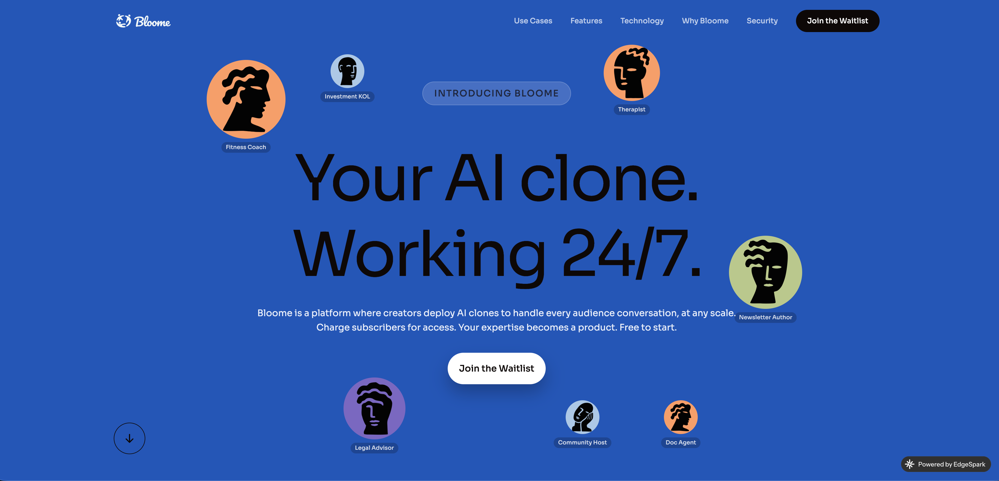
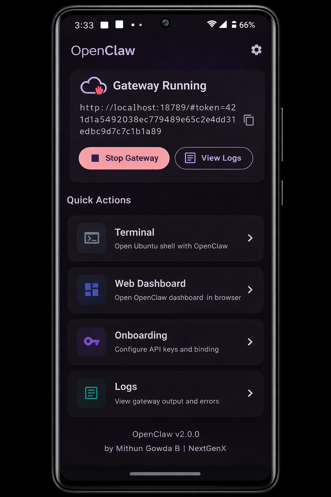
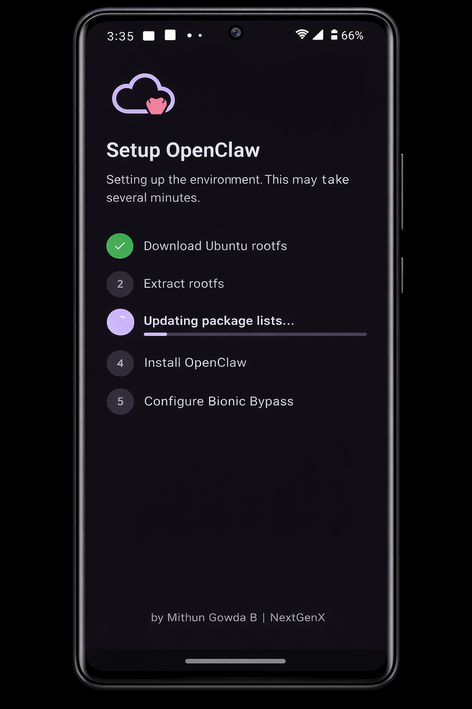
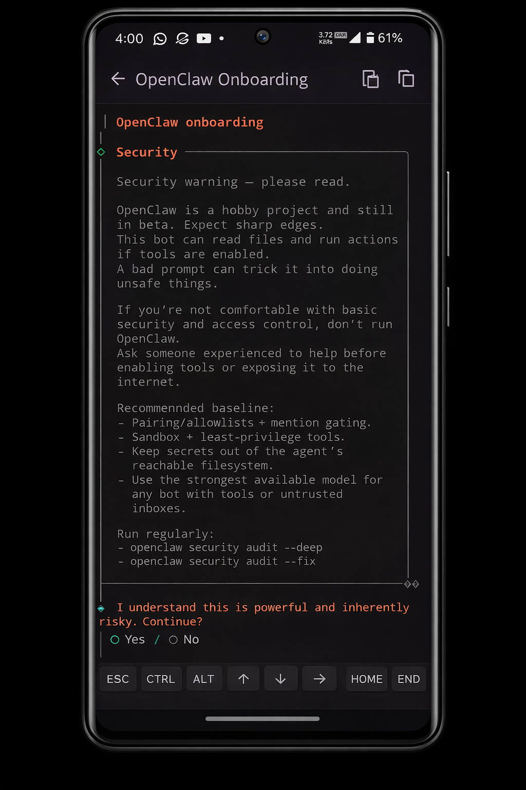
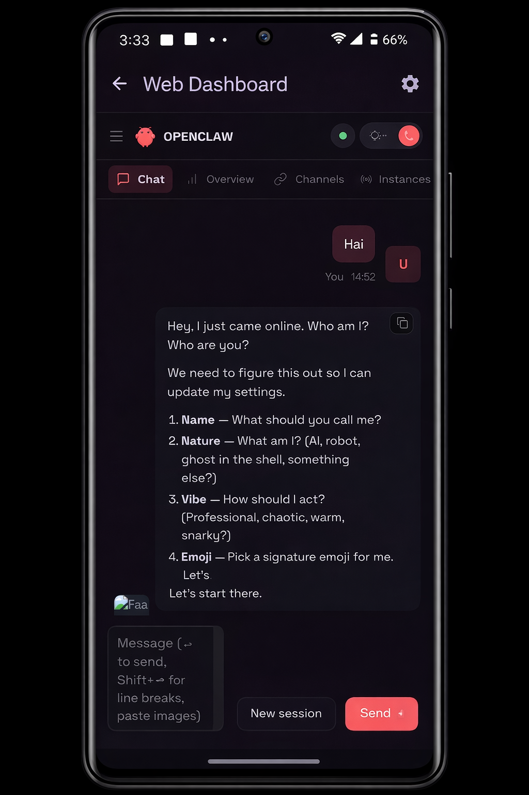
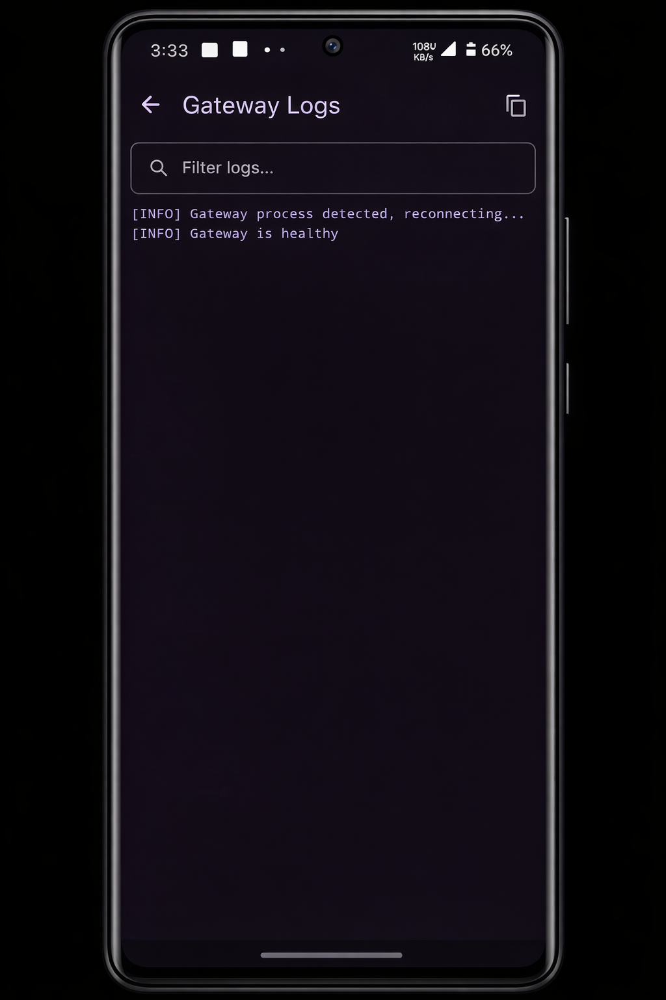
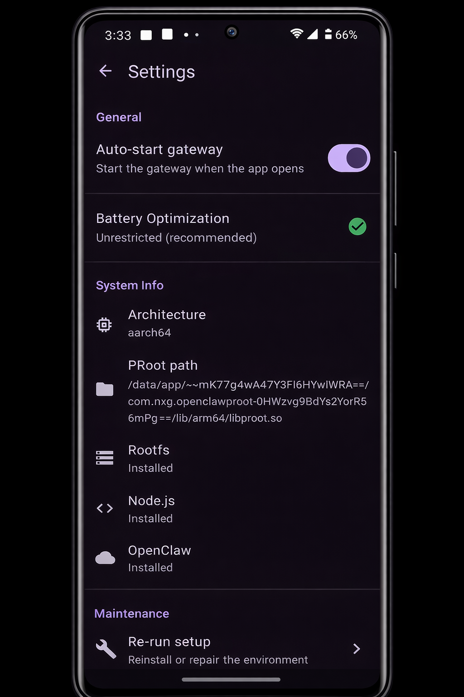

# OpenClaw

[](https://github.com/mithun50/openclaw-termux/releases/latest)
[](https://github.com/mithun50/openclaw-termux/actions/workflows/flutter-build.yml)
[](https://www.npmjs.com/package/openclaw-termux)
[](https://opensource.org/licenses/MIT)
[](https://nodejs.org/)
[](https://www.android.com/)
[](https://flutter.dev/)
[](https://github.com/mithun50/openclaw-termux/pulls)

<p align="center">
  
</p>

> Run **OpenClaw AI Gateway** on Android - standalone Flutter app with built-in terminal, web dashboard, optional dev tools, and one-tap setup. Also available as a Termux CLI package.

---

## Sponsored By

<p align="center">
  <a href="https://bloome.im/agent/join/0qrf0mWD?ref=TPKB3AAW" target="_blank">
    
  </a>
</p>

<p align="center">
  <a href="https://bloome.im/app?ref=TPKB3AAW&utm_medium=github&utm_source=mithun50-openclaw-termux-ivor-202606">
    
  </a>
</p>

**[Bloome](https://bloome.im/app?ref=TPKB3AAW&utm_medium=github&utm_source=mithun50-openclaw-termux-ivor-202606)** is the IM platform built for multi-agent collaboration - where AI agents join your group chats as teammates, not just tools. Creators, coaches, therapists, advisors, and developers deploy **AI clones of themselves** that handle every audience conversation at any scale, 24/7.

- **Deploy your AI clone** - configure it once with your expertise, tone, and knowledge
- **Handle every conversation** - your clone talks to your audience so you don't have to
- **Charge subscribers** - your expertise becomes a product. Free to start
- **Multi-agent workspace** - AI agents with names, memory, and roles work together in shared group chats
- **Works with any LLM** - build agents on Claude, GPT, Gemini, and more

> Your expertise, working while you sleep. [Join Bloome today](https://bloome.im/app?ref=TPKB3AAW&utm_medium=github&utm_source=mithun50-openclaw-termux-ivor-202606) and deploy your AI clone for free.

---

## Screenshots

<table align="center">
  <tr>
    <td align="center"><br/><b>Dashboard</b></td>
    <td align="center"><br/><b>Setup Wizard</b></td>
    <td align="center"><br/><b>Onboarding</b></td>
  </tr>
  <tr>
    <td align="center"><br/><b>Web Dashboard</b></td>
    <td align="center"><br/><b>Logs</b></td>
    <td align="center"><br/><b>Settings</b></td>
  </tr>
</table>

---

## What is OpenClaw?

OpenClaw brings the [OpenClaw](https://github.com/openclaw/openclaw) AI gateway to Android. It sets up a full Ubuntu environment via proot, installs Node.js and OpenClaw, and provides a native Flutter UI to manage everything - no root required.

### Two Ways to Use

| | **Flutter App** (Standalone) | **Termux CLI** |
|---|---|---|
| Install | Build APK or download release | `npm install -g openclaw-termux` |
| Setup | Tap "Begin Setup" | `openclawx setup` |
| Gateway | Tap "Start Gateway" | `openclawx start` |
| Terminal | Built-in terminal emulator | Termux shell |
| Dashboard | Built-in WebView | Browser at `localhost:18789` |

---

## Features

### Flutter App
- **One-Tap Setup** - Downloads Ubuntu rootfs, Node.js 22, and OpenClaw automatically
- **Built-in Terminal** - Full terminal emulator with extra keys toolbar, copy/paste, clickable URLs
- **Gateway Controls** - Start/stop gateway with status indicator and health checks
- **AI Providers** - Configure API keys and select models for 9 providers (Anthropic, OpenAI, Google Gemini, OpenRouter, NVIDIA NIM, DeepSeek, xAI, MiniMax, Ollama)
- **SSH Remote Access** - Start/stop SSH server, set root password, view connection info with copyable commands
- **Configure Menu** - Run `openclaw configure` in a built-in terminal to manage gateway settings
- **Node Device Capabilities** - 9 capabilities (21 commands) exposed to AI via WebSocket node protocol
- **Token URL Display** - Captures auth token from onboarding, shows it with a copy button
- **Web Dashboard** - Embedded WebView loads the dashboard with authentication token
- **View Logs** - Real-time gateway log viewer with search/filter
- **Onboarding** - Configure API keys and binding directly in-app
- **Optional Packages** - Install Go (Golang), Homebrew, and OpenSSH as optional dev tools
- **Settings** - Auto-start, battery optimization, system info, package status, re-run setup
- **Foreground Service** - Keeps the gateway alive in the background with uptime tracking
- **Setup Notifications** - Progress bar notifications during environment setup

### Optional Packages

After the initial setup completes, you can optionally install development tools directly from the app:

| Package | Install Method | Size |
|---------|---------------|------|
| **Go (Golang)** | `apt install golang` | ~150 MB |
| **Homebrew** | Official installer (with root workaround) | ~500 MB |
| **OpenSSH** | `apt install openssh-server` | ~10 MB |

These are accessible from:
- **Setup Wizard** - Package cards appear after setup completes
- **Dashboard** - "Packages" card in Quick Actions
- **Settings** - Shows installation status under System Info

### Node Device Capabilities

The Flutter app connects to the gateway as a **node**, exposing Android hardware to the AI. Permissions are requested proactively when the node is enabled.

| Capability | Commands | Permission |
|------------|----------|------------|
| **Camera** | `camera.snap`, `camera.clip`, `camera.list` | Camera |
| **Canvas** | `canvas.navigate`, `canvas.eval`, `canvas.snapshot` | None (not implemented) |
| **Flash** | `flash.on`, `flash.off`, `flash.toggle`, `flash.status` | Camera (torch) |
| **Location** | `location.get` | Location |
| **Screen** | `screen.record` | MediaProjection consent |
| **Sensor** | `sensor.read`, `sensor.list` | Body Sensors |
| **Haptic** | `haptic.vibrate` | None |
| **Battery** | `battery.status` | None |
| **Serial** | `serial.list`, `serial.connect`, `serial.disconnect`, `serial.write`, `serial.read` | USB device consent |

That is **9 capabilities / 21 commands**. Before each gateway start the app patches `openclaw.json` with:

```json5
{
  gateway: {
    nodes: {
      commands: { allow: ["camera.snap", "screen.record", "..."], deny: [] },
      pairing: { autoApproveLocal: true }
    }
  }
}
```

> **Note:** versions up to v1.8.7 wrote `gateway.nodes.allowCommands` / `denyCommands`, which OpenClaw does not read - so classified commands like `camera.snap` and `screen.record` were never actually authorised. Fixed in v2026.9.14 ([#81](https://github.com/mithun50/openclaw-termux/issues/81), [#95](https://github.com/mithun50/openclaw-termux/issues/95)).

#### Using a capability from the AI

1. Open the app, go to **Node** and toggle it on. Grant the Android permissions when prompted.
2. Wait for the badge to read **paired**. The node auto-approves on localhost.
3. Ask the assistant for something that maps to a command, e.g. *"take a photo with the back camera"* (`camera.snap`) or *"what's my location?"* (`location.get`).
4. Verify from a shell if needed:

```bash
openclawx nodes list                 # should list the Android device
openclawx nodes describe --node <id> # shows effective invoke commands
```

Camera, screen, sensor, flash and location commands need the app in the foreground - the app is brought forward automatically when a request arrives, so keep the screen unlocked.

### Termux CLI
- **One-Command Setup** - Installs proot-distro, Ubuntu, Node.js 22, and OpenClaw
- **Bionic Bypass** - Fixes `os.networkInterfaces()` crash on Android's Bionic libc
- **Smart Loading** - Shows spinner until the gateway is ready
- **Pass-through Commands** - Run any OpenClaw command via `openclawx`

---

## Important Warnings

> **Storage Permission** - This app does **NOT** need full storage access to function. If prompted, **deny** the storage permission unless you specifically need proot to access `/sdcard`. Granting `MANAGE_EXTERNAL_STORAGE` allows the proot environment to read and modify **all files** on your device including photos, downloads, and documents. Previous versions requested this permission automatically on launch, which could lead to unintended data loss (see [#67](https://github.com/mithun50/openclaw-termux/issues/67), [#63](https://github.com/mithun50/openclaw-termux/issues/63)). This has been fixed - storage access is now opt-in from Settings only.

> **Battery Optimization** - Disable battery optimization for the app in Android Settings to prevent Android from killing the gateway process in the background. Without this, the gateway may crash silently after a few minutes.

> **First Launch** - The initial setup downloads ~500MB (Ubuntu rootfs + Node.js). Ensure you have a stable internet connection and sufficient storage before starting.

---

## Quick Start

### Flutter App (Recommended)

1. Download the latest APK from [Releases](https://github.com/mithun50/openclaw-termux/releases)
2. Install the APK on your Android device
3. Open the app and tap **Begin Setup**
4. After setup completes, optionally install **Go** or **Homebrew** from the package cards
5. Configure your API keys in **Onboarding**
6. Tap **Start Gateway** on the dashboard

Or build from source:

```bash
git clone https://github.com/mithun50/openclaw-termux.git
cd openclaw-termux/flutter_app
flutter build apk --release
```

### Termux CLI

#### One-liner (recommended)

```bash
curl -fsSL https://raw.githubusercontent.com/mithun50/openclaw-termux/main/install.sh | bash
```

#### Or via npm

```bash
npm install -g openclaw-termux
openclawx setup
```

---

## Requirements

| Requirement | Details |
|-------------|---------|
| **Android** | 10 or higher (API 29) |
| **Storage** | ~500MB for Ubuntu + Node.js + OpenClaw |
| **Architectures** | arm64-v8a, armeabi-v7a, x86_64 |
| **Termux** (CLI only) | From [F-Droid](https://f-droid.org/packages/com.termux/) (NOT Play Store) |

---

## CLI Usage

```bash
# First-time setup (installs proot + Ubuntu + Node.js + OpenClaw)
openclawx setup

# Check installation status
openclawx status

# Start OpenClaw gateway
openclawx start

# Run onboarding to configure API keys
openclawx onboarding

# Enter Ubuntu shell
openclawx shell

# Any OpenClaw command works directly
openclawx doctor
openclawx gateway --verbose
```

### Optional X/Twitter Workflows With TweetClaw

OpenClaw-Termux can install regular OpenClaw plugins inside the Android Ubuntu runtime. For X/Twitter automation, install TweetClaw after setup:

```bash
openclawx plugins install @xquik/tweetclaw
openclawx plugins inspect tweetclaw --runtime
openclawx skills info tweetclaw
```

Use it for scrape tweets, search tweets, search tweet replies, follower export, user lookup, media workflows, direct messages, monitors, webhooks, giveaway draws, and reviewed post or reply workflows. See [TweetClaw Mobile X/Twitter Workflows](docs/tweetclaw-mobile-workflows.md) for Android credential handling, `tools.alsoAllow`, approval boundaries, and battery optimization notes.

---

## Architecture

```
┌───────────────────────────────────────────────────┐
│                Flutter App (Dart)                 │
│  ┌──────────┐ ┌──────────┐ ┌──────────────┐       │
│  │ Terminal │ │ Gateway  │ │ Web Dashboard│       │
│  │ Emulator │ │ Controls │ │   (WebView)  │       │
│  └─────┬────┘ └─────┬────┘ └──────┬───────┘       │
│        │            │             │               │
│  ┌─────┴────────────┴─────────────┴─────────────┐ │
│  │           Native Bridge (Kotlin)             │ │
│  └─────────────────┬────────────────────────────┘ │
│                    │                              │
│  ┌─────────────────┴────────────────────────────┐ │
│  │         Node Provider (WebSocket)            │ │
│  │  Camera · Flash · Location · Screen          │ │
│  │  Sensor · Haptic · Canvas                    │ │
│  └─────────────────┬────────────────────────────┘ │
└────────────────────┼──────────────────────────────┘
                     │
┌────────────────────┼──────────────────────────────┐
│  proot-distro      │              Ubuntu          │
│  ┌─────────────────┴──────────────────────────┐   │
│  │   Node.js 22.23 + Bionic Bypass            │   │
│  │   ┌─────────────────────────────────────┐  │   │
│  │   │  OpenClaw AI Gateway                │  │   │
│  │   │  http://localhost:18789             │  │   │
│  │   │  ← Node WS: 21 device commands      │  │   │
│  │   └─────────────────────────────────────┘  │   │
│  │   Optional: Go, Homebrew                   │   │
│  └────────────────────────────────────────────┘   │
└───────────────────────────────────────────────────┘
```

### Flutter App Structure

```
flutter_app/lib/
├── main.dart                  # App entry point
├── constants.dart             # App constants, URLs, author info
├── models/
│   ├── gateway_state.dart     # Gateway status, logs, token URL
│   ├── node_state.dart        # Node connection status
│   ├── node_frame.dart        # WebSocket frame model (req/res/event)
│   ├── setup_state.dart       # Setup wizard progress
│   ├── optional_package.dart  # Optional package metadata (Go, Homebrew)
│   └── ai_provider.dart       # AI provider data model (9 providers)
├── providers/
│   ├── gateway_provider.dart  # Gateway state management
│   ├── node_provider.dart     # Node capabilities + permission management
│   └── setup_provider.dart    # Setup state management
├── screens/
│   ├── splash_screen.dart     # Launch screen with routing
│   ├── setup_wizard_screen.dart    # First-time setup + optional packages
│   ├── onboarding_screen.dart      # API key configuration terminal
│   ├── dashboard_screen.dart       # Main dashboard with quick actions
│   ├── terminal_screen.dart        # Full terminal emulator
│   ├── configure_screen.dart       # openclaw configure terminal
│   ├── web_dashboard_screen.dart   # WebView for OpenClaw dashboard
│   ├── node_screen.dart             # Node capabilities + pairing
│   ├── providers_screen.dart       # AI provider list
│   ├── provider_detail_screen.dart # API key + model configuration
│   ├── ssh_screen.dart             # SSH server management
│   ├── packages_screen.dart        # Optional package manager
│   ├── package_install_screen.dart # Terminal-based package installer
│   ├── logs_screen.dart            # Gateway log viewer
│   └── settings_screen.dart        # App settings and about
├── services/
│   ├── native_bridge.dart     # Kotlin platform channel bridge
│   ├── gateway_config.dart    # Resolves gateway.port and dashboard URLs
│   ├── gateway_service.dart   # Gateway lifecycle, health checks, config patching
│   ├── node_service.dart      # Node WebSocket connection + invoke handling
│   ├── node_ws_service.dart   # Raw WebSocket transport
│   ├── node_identity_service.dart # Device identity + crypto signing
│   ├── terminal_service.dart  # proot shell configuration
│   ├── bootstrap_service.dart # Environment setup orchestration
│   ├── package_service.dart   # Optional package status checking
│   ├── preferences_service.dart # Persistent settings (token URL, etc.)
│   ├── provider_config_service.dart # AI provider config read/write
│   ├── ssh_service.dart       # SSH server management via native bridge
│   ├── update_service.dart    # GitHub release update check
│   ├── screenshot_service.dart # Screenshot capture helper
│   └── capabilities/
│       ├── capability_handler.dart   # Base class with permission handling
│       ├── battery_capability.dart   # Battery level/charge state
│       ├── camera_capability.dart    # Photo/video capture
│       ├── canvas_capability.dart    # WebView stub (NOT_IMPLEMENTED)
│       ├── flash_capability.dart     # Torch on/off/toggle
│       ├── location_capability.dart  # GPS with timeout + fallback
│       ├── screen_capability.dart    # Screen recording via MediaProjection
│       ├── sensor_capability.dart    # Accelerometer, gyroscope, etc.
│       ├── serial_capability.dart    # USB serial read/write
│       └── vibration_capability.dart # Haptic feedback
└── widgets/
    ├── gateway_controls.dart  # Start/stop, URL display, copy button
    ├── node_controls.dart     # Node enable/disable, status badge
    ├── terminal_toolbar.dart  # Extra keys (Tab, Ctrl, Esc, arrows)
    ├── status_card.dart       # Reusable status card
    └── progress_step.dart     # Setup wizard step indicator
```

---

## Configuration

### Onboarding

When running onboarding (in-app or via `openclawx onboarding`):

- **Binding**: Select `Loopback (127.0.0.1)` for non-rooted devices
- **API Keys**: Add your Gemini/OpenAI/Claude keys
- **Token URL**: The app automatically captures and stores the auth token URL (e.g. `http://localhost:18789/#token=...`)

### Gateway Port

The gateway listens on **18789** by default. To change it, set `gateway.port` in `openclaw.json`:

```bash
openclawx config set gateway.port 19000
```

Or edit `/root/.openclaw/openclaw.json` inside the proot environment:

```json5
{ gateway: { mode: "local", port: 19000 } }
```

Restart the gateway afterwards. The app reads `gateway.port` on every start and uses it for the health check, the dashboard URL, the node WebSocket connection and the notification, so the whole app follows your port.

Upstream precedence is `--port` > `OPENCLAW_GATEWAY_PORT` > `gateway.port` > `18789`.

> Versions up to v1.8.7 hard-coded 18789 in the app even when the config said otherwise, so a custom port left the app probing the wrong address ([#124](https://github.com/mithun50/openclaw-termux/issues/124)). Fixed in v2026.9.14.

### SSH Remote Access

SSH lets you reach the Ubuntu proot environment from a computer on the same network. The server runs **inside proot**, so you get the same root shell the gateway uses.

**Setup, in order:**

1. Install OpenSSH: **Settings > Packages > OpenSSH** (or `openclawx shell` then `apt install -y openssh-server`).
2. Open the **SSH** screen in the app.
3. Tap **Set Root Password** and choose a strong password. **This step is mandatory** - the server refuses to start without it.
4. Tap **Start SSH**. The screen then shows the exact `ssh` command to run, with a copy button.
5. From your computer, run the command shown, for example:

```bash
ssh root@192.168.1.42 -p 8022
```

**What the defaults are and why:**

| Setting | Value | Reason |
|---------|-------|--------|
| Port | `8022` | Non-privileged; proot cannot bind port 22 |
| User | `root` | proot fakes root; there is no other account |
| `PermitRootLogin` | `yes` | Required, since root is the only user |
| `PermitEmptyPasswords` | `no` | Prevents a passwordless root shell |
| `ListenAddress` | `0.0.0.0` | Binds all interfaces so it survives VPN/Wi-Fi changes ([#61](https://github.com/mithun50/openclaw-termux/issues/61)) |

> **Security:** because `ListenAddress` is `0.0.0.0`, anyone on your Wi-Fi can reach port 8022. Your root password is the only thing protecting the device - use a strong one, and stop the SSH server when you are done. On untrusted networks (cafés, hotels, offices) leave it off.

Since v2026.9.14 the server performs a pre-flight check and refuses to start when root has no password hash in `/etc/shadow`, instead of exposing an open port ([#107](https://github.com/mithun50/openclaw-termux/issues/107)).

**Troubleshooting:**

- *"Set a root password before starting SSH"* in the notification - do step 3 above.
- *Connection refused* - the server is not running, or you used port 22 instead of 8022.
- *IP not reachable* - the app lists every device IP; use the one on the same subnet as your computer.
- *Permission denied* - the password was not set, or you are connecting as a user other than `root`.

### Local Models with Ollama

Ollama runs open models on your own hardware, so no API key and no cloud round-trip. Run the daemon on a machine on your network (a phone is usually too slow for larger models):

```bash
# On your PC / server
ollama serve
ollama pull qwen3:8b
```

Then in the app: **Providers > Ollama**, leave the API key blank, and set the base URL to your host:

```
http://192.168.1.10:11434
```

The app writes this to `openclaw.json`:

```json5
{
  models: {
    providers: {
      ollama: {
        apiKey: "ollama-local",
        baseUrl: "http://192.168.1.10:11434",  // no /v1
        api: "ollama",
        timeoutSeconds: 300,
        models: [{ id: "qwen3:8b", name: "qwen3:8b" }]
      }
    }
  },
  agents: { defaults: { model: { primary: "ollama/qwen3:8b" } } }
}
```

> **Do not add `/v1`.** OpenClaw talks to Ollama's native `/api/chat` endpoint. The `/v1` OpenAI-compatible path breaks tool calling and models emit raw tool-call JSON as text. The app strips a trailing `/v1` for you. See [#117](https://github.com/mithun50/openclaw-termux/issues/117).

Ollama Cloud works too - use `https://ollama.com` as the base URL with a real API key.

### Battery Optimization

> **Important:** Disable battery optimization for the app to keep the gateway alive in the background.

**For the Flutter app:** Settings > Battery Optimization > tap to disable

**For Termux:** Android Settings > Apps > Termux > Battery > **Unrestricted**

---

## Dashboard

Access the web dashboard at the token URL shown in the app (e.g. `http://localhost:18789/#token=...`).

The Flutter app automatically loads the dashboard with your auth token via the built-in WebView.

| Command | Description |
|---------|-------------|
| `/status` | Check gateway status |
| `/think high` | Enable high-quality thinking |
| `/reset` | Reset session |

---

## Troubleshooting

### Files deleted or missing after using the app

Versions before v1.8.4 automatically requested full storage access (`MANAGE_EXTERNAL_STORAGE`) on launch. Combined with symlinks inside the proot rootfs pointing to `/sdcard`, cleanup operations could follow those symlinks and delete real user files. **This has been fixed** - storage permission is no longer auto-requested, symlinks are not followed during deletion, and a path boundary check prevents any deletion outside the app's private directory. If you were affected, see [#67](https://github.com/mithun50/openclaw-termux/issues/67).

To revoke storage permission: Android Settings > Apps > OpenClaw > Permissions > Files and media > Don't allow.

### Gateway won't start

```bash
# Check status
openclawx status

# Re-run setup if needed
openclawx setup

# Make sure onboarding is complete
openclawx onboarding
```

### "os.networkInterfaces" error

Bionic Bypass not configured. Run setup again:

```bash
openclawx setup
```

### Process killed in background

Disable battery optimization for the app in Android settings.

### Permission denied

```bash
termux-setup-storage
```

---

## Manual Setup

<details>
<summary>Click to expand manual installation steps</summary>

### 1. Install proot-distro and Ubuntu

```bash
pkg update && pkg install -y proot-distro
proot-distro install ubuntu
```

### 2. Setup Node.js in Ubuntu

```bash
proot-distro login ubuntu
apt update && apt install -y curl
curl -fsSL https://deb.nodesource.com/setup_22.x | bash -
apt install -y nodejs
npm install -g openclaw
```

### 3. Create Bionic Bypass

```bash
mkdir -p ~/.openclaw
cat > ~/.openclaw/bionic-bypass.js << 'EOF'
const os = require('os');
const originalNetworkInterfaces = os.networkInterfaces;
os.networkInterfaces = function() {
  try {
    const interfaces = originalNetworkInterfaces.call(os);
    if (interfaces && Object.keys(interfaces).length > 0) {
      return interfaces;
    }
  } catch (e) {}
  return {
    lo: [{
      address: '127.0.0.1',
      netmask: '255.0.0.0',
      family: 'IPv4',
      mac: '00:00:00:00:00:00',
      internal: true,
      cidr: '127.0.0.1/8'
    }]
  };
};
EOF
```

### 4. Add to bashrc

```bash
echo 'export NODE_OPTIONS="--require ~/.openclaw/bionic-bypass.js"' >> ~/.bashrc
source ~/.bashrc
```

### 5. Run OpenClaw

```bash
openclaw onboarding  # Select "Loopback (127.0.0.1)"
openclaw gateway --verbose
```

</details>

---

## Contributing

Contributions are welcome! Please feel free to submit a Pull Request.

1. Fork the repository
2. Create your feature branch (`git checkout -b feature/amazing-feature`)
3. Commit your changes (`git commit -m 'Add amazing feature'`)
4. Push to the branch (`git push origin feature/amazing-feature`)
5. Open a Pull Request

---

## Author

**Mithun Gowda B**

- GitHub: [@mithun50](https://github.com/mithun50)
- Email: [mithungowda.b7411@gmail.com](mailto:mithungowda.b7411@gmail.com)
- Issues: [openclaw-termux/issues](https://github.com/mithun50/openclaw-termux/issues)

---

## License

MIT License - see [LICENSE](LICENSE) file for details.

---
## ⭐ Star History

[](https://star-history.dera.page/#mithun50/openclaw-termux&Date)


<p align="center">
  Made with &#10084;&#65039; for the Android community by <a href="https://github.com/mithun50">Mithun Gowda B</a>
</p>
